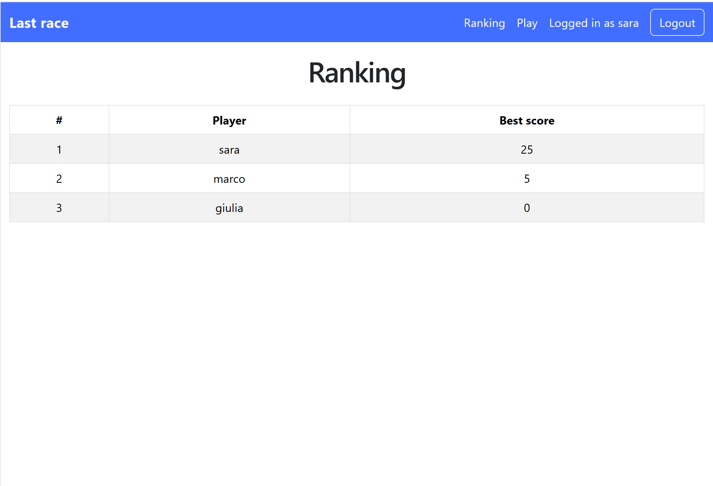
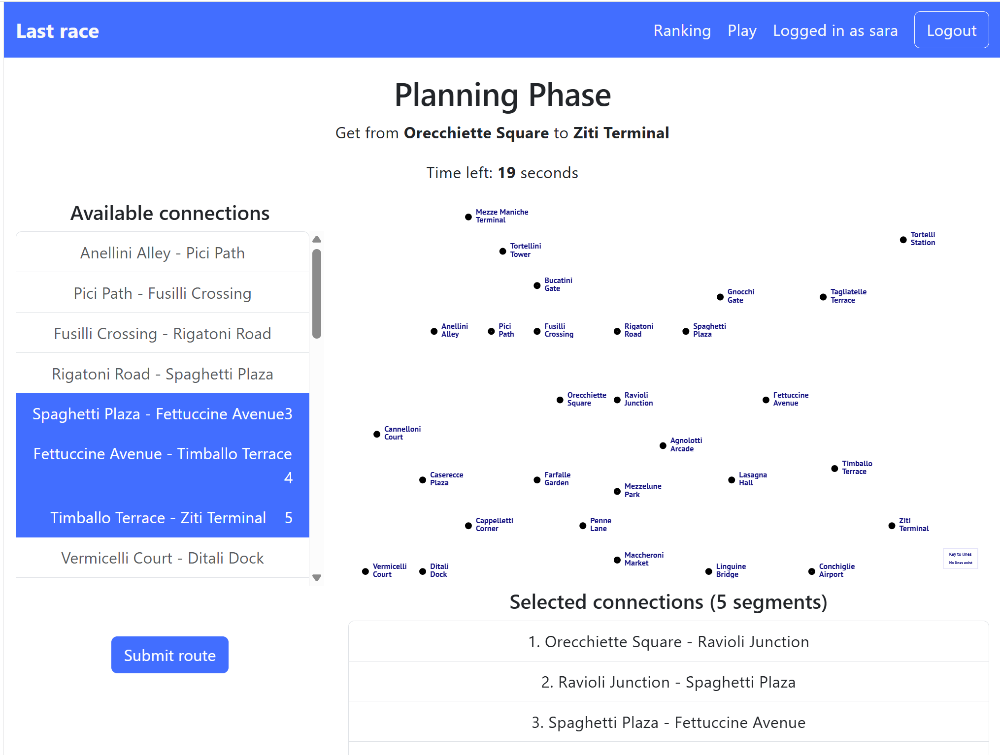

# Exam : "Last Race"
## Student: s353341 Falorni Sara

## Database Tables

- Table `users` - contains userId, username,  hashedPassword, salt, bestResult
- Table `connections` - contains connectionId, station1, station2, line 
- Table `events`- contains eventId, name, effect
- Table `stations` - contains stationId, name


## Data models

```js
function User(userId, username, bestResult ) {
  this.userId = userId;
  this.username = username;
  this.bestResult = bestResult;
}
```

```js
function Connection(connectionId, station1, station2, line) {
  this.connectionId = connectionId;
  this.station1 = station1;
  this.station2 = station2;
  this.line = line;
}
```

```js
function Event(eventId, name, effect) {
  this.eventId = eventId;
  this.name = name;
  this.effect = effect;
}
```

```js
function Station(stationId, name) {
  this.stationId = stationId;
  this.name = name;
}
```


## API Server

## Authentication

### `GET /api/sessions/current`

- Response body:

```json
{
  "userId": 1,
  "username": "sara",
  "bestResult": 24
}
```
- Status codes: `200 OK`, `401 Unauthorized`, `500 Internal Server Error`

### `POST /api/sessions`

- Request body:

```json
{
  "username": "sara",
  "password": "password"
}
```

- Response body:

```json
{
  "userId": 1,
  "username": "sara",
  "bestResult": 24
}
```

- Status codes: `200 OK`, `401 Unauthorized` , `500 Internal Server Error`, `422 Unprocessable Entity` 

### `DELETE /api/sessions/current`

- Request body: none
- Response body: none

- Status codes: `200 OK`, `500 Internal Server Error`

## Game

### `POST /api/games`

starts a new game for a logged in user (assigns random start and destination stations and returns all available connections in the network and the game duration)

- Request body: none
- Response body: 

```json
{
  "startStation": { "stationId": 1, "name": "Anellini Alley" },
  "destinationStation": { "stationId": 4, "name": "Rigatoni Road" },
  "availableConnections": [
    {
      "connectionId": 1,
      "station1": 1,
      "station1Name": "Anellini Alley",
      "station2": 2,
      "station2Name": "Pici Path"
    }
  ],
  "durationSeconds": 90
}
```
- Status codes: `200 OK`, `401 Unauthorized`, `500 Internal Server Error`

### `POST /api/games/current/route`

submits user's route, the server validates it and applies the random events, finally computes the score.
It returns wheter the route is valid or not, ans the final score; in the first case also return the list of steps (a step is a connection,the associated event and the coins after the step).

- Request body: the ordered list of selected connection ids

```json
{
  "connectionIds": [1, 2, 3]
}
```

- Response body (valid route):

```json
{
  "valid": true,
  "initialCoins": 20,
  "stepsTaken": [
    {
      "connectionId": 1,
      "fromStation": 1,
      "toStation": 2,
      "fromStationName": "Anellini Alley",
      "toStationName": "Pici path",
      "line": "Egg",
      "event": { "eventId": 7, "name": "Train Arrives Early", "effect": 1 },
      "coinsAfterStep": 21
    }
  ],
  "finalScore": 21
}
```

- Response body (invalid route):

```json
{
  "valid": false,
  "reason": "A connection can't be used more than once",
  "finalScore": 0
}
```

- Status codes: `200 OK`, `401 Unauthorized`, `422 Unprocessable Entity` (invalid body), `500 Internal Server Error`

## Ranking

### `GET /api/ranking`
returns the ranking in descending order, including only users that played at least one game 
(user.bestResult == NULL means no game has been played yet)

- Response body:

```json
[
  { "position": 1, "username": "sara", "bestResult": 24 },
  { "position": 2, "username": "marco", "bestResult": 5 }
]
```

- Status codes: `200 OK`, `401 Unauthorized`, `500 Internal Server Error`


## React Client Application Routes

- Route `/`: home page (displays the game rules, login button)
- Route `/login`: login page (contain the login form)
- Route `/ranking`: ranking page (contains the ranking)
- Route `/game`: game page (the main page to start and play a game)
- Route `*` : page not found


## Main React Components

- `NavHeader` 
  - `LogoutButton` 
  - `LoginButton`
- `HomePage`
  - `PlayButton`
- `LoginForm`
- `RankingPage`
  - `RankTable`
- `GamePage`
- `SetupPhase`
  - `StartGameButton`
- `PlanningPhase` 
  - `AvailableConnectionsList`
  - `SelectedConnectionsList`
  - `SubmitButton`
- `ExecutionPhase` 
  - `StepsTable`
  - `SeeSummaryButton`
- `SummaryPhase`
  - `FinalScore`
  - `StartNewGameButton`


## Screenshot

### Ranking page



### Game page (during execution phase)



## Users Credentials

- sara, password 
- marco, password 
- giulia, password 
- luca, password (hasn't played a game yet)

## Use of AI Tools

- Database population
- Game rules description in `Homepage`


